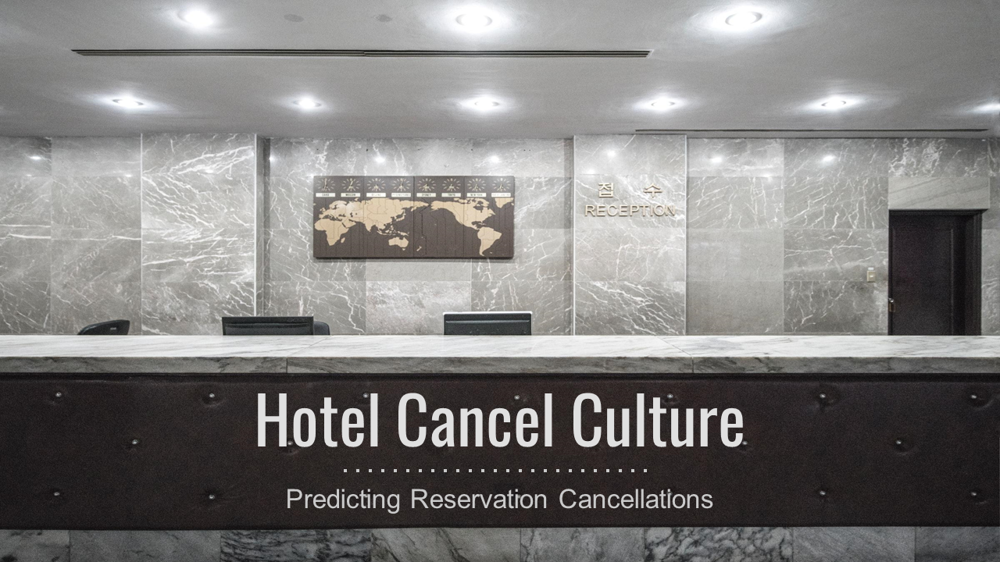
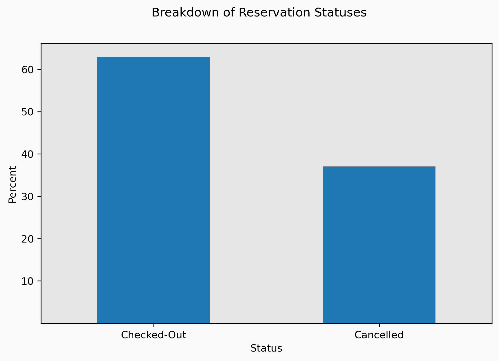
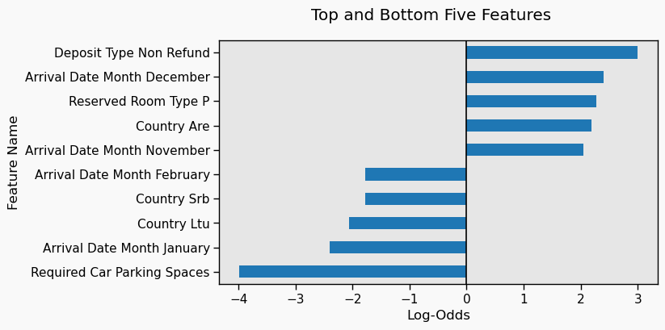

</br>
</br>
</br>

---

</br>
</br>

# Hotel Cancel Culture

*Predicting hotel reservation cancellations through machine learning modeling.*

Author: Ben McCarty

---
## Overview

* Problem: hotels need to know the likelihood of a reservation not actualizing (cancelling or DNA) for forecasting business
* Data: reservation data from two European hotels from 2015-2017
* Methods: performed machine learning modeling techniques to determine the top reservation details to indicate whether a reservation wil actualize
* Results: *pending*
* Recommendations: *pending*

> *Insert attention-grabbing start line.*

Every aspect of hospitality depends on accurately anticipating business demand: how many rooms to clean; how many rooms are available to sell; what would be the best rate; and particularly for the Front Desk, how to bring it all together to make every guest satisfied. Proper forecasting is critical to every department and staff member, and to generate our forecasts, we needed to know how many guests would cancel prior to arrival. Using data from two European hotels, I developed a model to predict whether a given reservation would cancel based on a variety of reservation features, including arrival date details; stay length; and rates. My results highlighted five features as the strongest indicators of cancellations. Based on those results, 

---
## Business Problem


* Maximizing revenue:
    *   Cancellations/no-shows negatively impact revenue - prevent other bookings; hard to collect on no-show reservations
    * Anticipating number of no-show reservations
    * Determining by how many rooms to oversell (assuming cancellations/no-shows)

* Minimizing costs:
    * Operations teams rely heavily on accurate forecasts for scheduling and supplies
    * Minimizing labor, supply costs using accuarate occupancy forecasts
    * Addressing potential causes for cancellations (e.g. restricting number of bookings from an OTA with high likelihood of cancellations)
    * Minimizing reservation relocation costs in case of oversell

* Hotel teams need to know what reservation characteristics can help them determine the number of cancellations
    * What is the impact of the booking date on the odds of a cancellation?
    * Are reservations from a particular booking agent more likely to cancel than others?

* How did you pick the data analysis question(s) that you did?
    * Prior experience in industry - aim to minimize disruption to guests and hotel staff; increase revenue by identifying reservations most likely to cancel to confirm bookings in advance

---
## Data




> *Breakdown of reservations between checkouts and cancellations*


* Where did the data come from, and how do they relate to the data analysis questions?
    * Reservation data originally sourced from two anonymous hotels in Europe

* What do the data represent? Who is in the sample and what variables are included?
    * Each observation represents a single reservation
    * Reservation characteristics are common for most hotels (e.g. room types, marketing details, rates, and room types)

* What is the target variable?
    * Target variable is "`is_canceled`," representing whether the reservation actualized (stayed and checked-out) or if the reservation cancelled 
        * Cancellations include a small number of no-show reservations; considered to be canceled for analysis and predictions

* What are the properties of the variables you intend to use?
    * Mix of categorical and continuous data,such as:
        * Categorical variables: room type booked/assigned; country of origin; and meal type purchased with reservation.
        * Continuous variables: number of guests; rate; number of special requests; etc..

---
## Methods

### EDA and Prep Work


* Preparations included:
    * Addressing missing values by dropping `company` with 95% of the values missing
        * In my experience, reservations are unlikely to include this information directly
    * Filling in the few remaining missing entries with the most frequent values for each characteristic
    * Converting the `agent` identifier characteristic into four groups (vs. the original 300+ values)

* Exploratory analysis included statistical overviews and visualizations of each characteristic's data

---
## Modeling and Evaluating Results

* Modeling techniques utilized a logisitic regression model as well as variations of tree-based models
    * Logisitic regression:
        * Results are easily interpretable and are quickly available - required in a fast-paced work environment requiring decisiveness
        * Does not handle extreme/irregular data well
    * Tree-based models:
        * Handle extreme/irregular data better than logistic regression (e.g. a guest had an extreme number of requests; rates signficantly higher than average due to major events; frequently booking and canceling reservations)
        * Results are more difficult to interpret, requiring additional tools and understanding to interpret


---
## Results

**Results**

### Logistic Regression Results


* Most likely to cancel:
    * Logistic Regression:
        * Deposit Type: Non-Refundable
            * May be pre-paid/third-party reservations that require the guest to pay in advance to the booking group
        * Arrival Month: December
            * Weather-related cancellations
            * Booking in advance, but changing plans
        * Reserved Room Type: P
            * Prior experience: room types were basic-top tiers, letters a-z
                * This would indicate the room would be a high-quality/luxury-type room
            * Due to anonymization of data, cannot interpret too clearly/deeply
                * Specific room details (i.e. basic, upgraded, deluxe, luxury, suite, etc.) would deepen understanding

* Least likely to cancel:
    * Logistic Regression:
        * Required Car Parking Spaces
            * *IFF* guests inlcude these details on reservation *prior to arrival,* then would indicate follow-through/commitment to booking
            * Strong possibility for this information not to be available prior to arrival
                * Future work: remove this feature and re-train/-test model's performance
        * Arrival Month: January
            * Post-holiday return to work; fewer holiday plans being changed/canceled
        * Country: LTU
            * Requires further investigation
            * Future work: compare against other countries' results


# ONLY USE FEAT IMP IF SHAP WORKING!

### Feature Importances

### SHAP Results


* Extra Trees Classifier - Feature Importances:
    * Country: PRT
    * Lead Time
    * Deposit Type: Non-Refundable
    * Deposit Type: No Deposit
    * Total of Special Requests
    * ADR

**Generalizability**

* Dependent on availability of information
    * Inconsistent availability - sometimes have certain info (company, # car spots, country), sometimes not
    * Future work: reduce features to the minimums to increase applicability
* Depends on maintaining trends
    * Reliant on historical records
        * COVID creates major challenge due to foundational disruptions
            * E.G. travel restrictions; remote work vs. business travel; limitations on events; guest concerns about travel/cleanliness
    * Future work: add means to "learn" from new data/trends
* Does not take into account additional demand generators:
    * Major regional/local events
        * Expos, conferences, music festivals, etc.
    * Sales/promos
* Does not factor for short-term/immediate trends
    * Local conditions, such as a snowstorm, may cause last-minute bookings/cancellations that are not predictable by this model
    * Future work: short-term, in-the-day/for-the-day analysis/advice


---
## Conclusions

**RECOMMENDATIONS**

Log-Reg-Based:
* Check % non-refundable that are OTA bookings - consider capping bookings to limit risk of cancellations
* Allow for more overbookings in November/December - higher likelihood of cancellations opening up availability
* Allow for fewer overbookings in January/February - lower likelihood of cancellations increases risk of overselling hotel

Random-Forest-Based:
* test
* test
* test

**Considerations**

* While the likelihood of a cancellation is an important consideration, need to consider ADR and incidental revenue (food/beverage outside of packages; additional amenities (spa, golf, etc.))
* These are guidelines, not hard-and-fast rules - on-going observations, evaluations, and adjustments are required to maximize revenue

**Next Steps**

* Increase generalizability by removing certain features based on personal experience
    * Certain features are less likely to be present/distinct on reservations:
        * Number of adults/children/babies usually isn't specified (in my experience) - usually some default value of 1 or 2 adults
            * Not the case for all hotels, though!
        * Whether a guest is parking is determined during registration - not always indicated in advance
            * Makes this feature less reliable for predictions
        * Meals are not universally included on reservations, preventing hotels from using that feature for evaluations

* Use the odds of cancellations for time series forecasting
    * Add a new feature consisting of the odds of each feature to cancel
    * Perform uni- and multi-variate time series modeling to forecast cancellations in the future

---
## For More Information

Please review our full analysis in [the main Jupyter Notebook](./Classification_Modeling.ipynb) or my [presentation](./Hotel_Cancel_Culture_Presentation.pdf).

For any additional questions, please reach out to me via:

- [Email](mailto:bmccarty505@gmail.com)

- [LinkedIn](www.linkedin.com/in/bmccarty505)

- [GitHub](www.github.com/BenJMcCarty)

---
## Repository Structure

Describe the structure of your repository and its contents, for example:

```
├── README.md
├── Classification_Modeling.ipynb
├── EDA_for_Classification.ipynb
├── Hotel_Cancel_Culture_Presentation.pdf
├── data
    └── data_prepped.pickle
    └── data_no_assigned.pickle
    └── hotel_bookings.csv.gz
    └── hotel_bookings.pickle
├── img
    └── log_odds.png
└── bmc_functions
    └── __init__.py
    └──classification.py
    └──eda.py
    └──functions.py
    └──regression.py
    └──time_series_modeling.py
```
