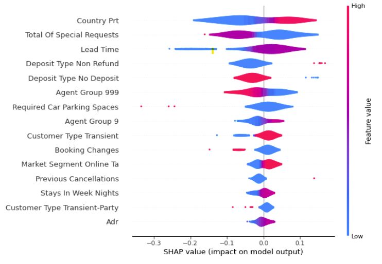

</br>
</br>


# Hotel Cancel Culture

*Predicting hotel reservation cancellations through machine learning modeling.*

Author: Ben McCarty


## Overview

> *Have you ever booked a reservation at a hotel, only to find out that your reservation was relocated somewhere else? Or tried to book a reservation for a big concert or event, only to find out the hotel is sold out?*

**Every aspect of hospitality depends on accurately anticipating business demand: how many rooms to clean; how many rooms are available to sell; what would be the best rate; and how to bring it all together to make every guest satisfied.** Proper forecasting is critical to every department and staff member, and to generate our forecasts, hotel managers need to know how many guests will cancel prior to arrival. Using data from two European hotels, I developed a model to predict whether a given reservation would cancel based on 30 different reservation details. My results highlighted three features as the strongest predictors of cancellations, and the results may surprise you!


## Business Problem

Hotels sell more than room rentals - they sell an *experience.* As a six-year veteran of hotel Operations teams, I learned there is a constant balancing act performed on a daily basis: **how can we sell as many rooms as possible without over-booking?**

Hotels, like any business, aim to maximize their revenue and minimize costs. However, plans change. Reservations booked a year in advance may suddenly cancel due to anything from a stomach ache to COVID-19. While the recent pandemic is certainly an anomaly when it comes to predicting and forecasting cancellations, **hotels already strive to optimize their sales, and to that end, they need to know which reservations are most likely to cancel, opening up more rooms for sale.**

Cancellations and no-shows negatively impact revenue by preventing other bookings - and in the case of no-shows, it is notoriously difficult to collect on any fees. One solution is to allow for a certain number of over-bookings during busy times. Overselling a hotel helps account for cancellations by allowing reservations to exceed hotel capacity with the expectation that reservations will cancel or not arrive. *This isn't without risk, though.*

When a hotel over-books and reach full occupancy, any guest arriving late may end up not having a room. In those cases, hotels relocate the reservation to another nearby hotel at the htoel's expense. If you never experienced being "walked" by a hotel, trust me, being relocated is not a pleasant experience for you or the staff.

Beyond the costs of "walking" guests, hotel teams need precise forecasts of how busy the hotel will be, and these forecasts rely on predicting cancellations. From scheduling to supplies, hote managers need to be able to anticipate how busy the hotel will be. As a prior hotel operations manager, my main focus would range from 0 days (same-day arrivals) to ten days ahead of time. I needed to know how many staff members to schedule and when. I needed to prepare for oversold days. I needed to know my guests, their needs, and how to maintain the balancing act between guest and business needs.

My newly-developed data science skills give me the techniques I need to predict cancellations, but I still rely on one key thing: *the data*.


## Data


> *Breakdown of reservations between checkouts and cancellations*

My dataset came from [this Kaggle dataset](https://www.kaggle.com/jessemostipak/hotel-booking-demand) and is originally sourced from the following article:

> Nuno Antonio, Ana de Almeida, Luis Nunes,
> 
> Hotel booking demand datasets,
> 
> Data in Brief,
> 
> Volume 22,
> 
> 2019,
> 
> Pages 41-49,
> 
> ISSN 2352-3409,
> 
> https://doi.org/10.1016/j.dib.2018.11.126.
> 
> (https://www.sciencedirect.com/science/article/pii/S2352340918315191)
> 
> Abstract: This data article describes two datasets with hotel demand data. One of the hotels (H1) is a resort hotel and the other is a city hotel (H2). Both datasets share the same structure, with 31 variables describing the 40,060 observations of H1 and 79,330 observations of H2. Each observation represents a hotel booking. Both datasets comprehend bookings due to arrive between the 1st of July of 2015 and the 31st of August 2017, including bookings that effectively arrived and bookings that were canceled. Since this is hotel real data, all data elements pertaining hotel or costumer identification were deleted. Due to the scarcity of real business data for scientific and educational purposes, these datasets can have an important role for research and education in revenue management, machine learning, or data mining, as well as in other fields.


As mentioned in the abstract, this reservation data was originally sourced from two anonymous hotels in Europe. Each observation represents a single reservation, witch characteristics common for most hotels (e.g. room types, marketing details, rates, and room types).

My target variable is "`is_canceled`," representing whether the reservation actualized (stayed and checked-out) or if the reservation cancelled. These cancellations include a negligible number of no-show reservations and are considered to be canceled for analysis and predictions.


## Methods

### EDA and Prep Work

My preparations included:
    * Addressing missing values by dropping the `company` feature with 95% of the values missing
    * Filling in the few remaining missing entries with the most frequent values for each characteristic
    * Condensing large categorical features (100+ categories) into 4-5 distinct categories summarizing the categories with the strongest impacts.

Additionally, my exploratory analysis included statistical overviews each characteristic's data, giving insight into extreme values as well as highlighting such large categorical features.


## Modeling and Evaluating Results

I chose to use a Random Forest Classifier for my final predictions as they handle extreme/irregular data better than logistic regressions (e.g. a guest had an extreme number of requests; rates signficantly higher than average due to major events; frequently booking and canceling reservations).

However, the results are more difficult to interpret, requiring additional tools to interpret effectively. I used SHAP visualization techniques to help identify the most important aspects of a guest's stay and their impact.


## Results

**Results**

### SHAP Results


> Based on the results of my RandomForestClassifier and visualization of my SHAP plot, I determined that...
* Reservations from Portugal are more likely to cancel vs. reservations from other countries
* Reservations with no special requests are more likely to cancel - however any amount of requests may decrease likelihood of cancellation
* Higher lead times show a slightly positive relationship with cancellations
* Reservations listed not as "non-refundable" are less likely to cancel
* Reservations listed as "no deposit" are less likely to cancel

**Generalizability**

These results are dependent on availability of information - some information is not consistently available, or available at all for some hotels. Furthermore, these results assume relatively stable trends as they depend on historical records. Anomalies such as COVID-19 cause radical shifts in the nature of travel, potentially requiring hotel teams to ignore the old data and assumptions. Finally, this analysis does not take into consideration demand generators occurring close to booking - bad weather, event cancellations, etc. may increase cancellations *or cause surges in bookings to avoid icy roads or power outages.*


## Conclusions

**RECOMMENDATIONS**

Based on my results, I recommend these hotels should do the following:

* Contact guests with long lead times to confirm bookings
* Monitor bookings from Portugal versus other countries
* Limit availability of non-refundable rates to prevent/limit risk of cancellations

**Considerations**

* While the likelihood of a cancellation is an important consideration, need to consider ADR and incidental revenue (food/beverage outside of packages; additional amenities (spa, golf, etc.))
* These are guidelines, not hard-and-fast rules - on-going observations, evaluations, and adjustments are required to maximize revenue

**Next Steps**

* Increase generalizability by removing certain features based on personal experience
    * Certain features are less likely to be present/distinct on reservations:
        * Number of adults/children/babies usually isn't specified (in my experience) - usually some default value of 1 or 2 adults
            * Not the case for all hotels, though!
        * Whether a guest is parking is determined during registration - not always indicated in advance
            * Makes this feature less reliable for predictions
        * Meals are not universally included on reservations, preventing hotels from using that feature for evaluations

* Use the odds of cancellations for time series forecasting
    * Add a new feature consisting of the odds of each feature to cancel
    * Perform uni- and multi-variate time series modeling to forecast cancellations in the future

## For More Information

Please review our full analysis in the [notebooks directory](./notebooks/) or my [presentation](./presentations/Hotel_Cancel_Culture_Presentation.pdf).

For any additional questions, please reach out to me via:

- [Email](mailto:bmccarty505@gmail.com)

- [LinkedIn](www.linkedin.com/in/bmccarty505)

- [GitHub](www.github.com/BenJMcCarty)


## Repository Structure

This project follows a structured notebook-based workflow organized by the CRISP-DM framework:

```
├── README.md
├── config/
│   └── config.yaml
├── data/
│   ├── Feature_Dictionary.md
│   ├── 3.1_temporally_updated_data.parquet
│   ├── 3.2_data_with_occupancies.parquet
│   ├── raw/
│   │   ├── H1.csv
│   │   ├── H2.csv
│   │   ├── H1.parquet
│   │   ├── H2.parquet
│   │   └── combined.parquet
│   └── supplemental/
│       └── [26 supplemental data files including economic, tourism, and weather data]
├── img/
│   ├── title.png
│   ├── SHAP_Results.png
│   ├── SHAP_Results_H1_HGBC.png
│   ├── SHAP_Results_H1_RFC.png
│   └── SHAP_Results_H2.png
├── notebooks/
│   ├── 1.0_Data_Extraction_and_Transformation/
│   │   ├── 1.1_Source_Data.ipynb
│   │   └── 1.2_Concatenate_Data.ipynb
│   ├── 2.0_EDA_and_Baseline_Models/
│   │   ├── 2.1_Initial_EDA.ipynb
│   │   ├── 2.2.1_Baseline_Classification_Modeling_H1.ipynb
│   │   └── 2.2.2_Baseline_Classification_Modeling_H2.ipynb
│   ├── 3.0_Feature_Engineering/
│   │   ├── 3.1_Temporal_Features.ipynb
│   │   └── 3.2_Occupancy_Calculations.ipynb
│   └── 4.0_Advanced_Modeling/
│       ├── 4.1.1_Classifying_Cancellations.ipynb
│       ├── 4.2.1_Classifying_Cancellations_-_Hotel_1.ipynb
│       ├── 4.2.1_Classifying_Cancellations_-_Hotel_2.ipynb
├── presentations/
│   ├── Hotel_Cancel_Culture_Presentation.pdf
│   └── Hotel_Cancel_Culture_Presentation.pptx
└── src/
    ├── __init__.py
    ├── classification.py
    ├── data_preprocessing.py
    ├── db_utils.py
    ├── eda.py
    ├── functions.py
    ├── regression.py
```
